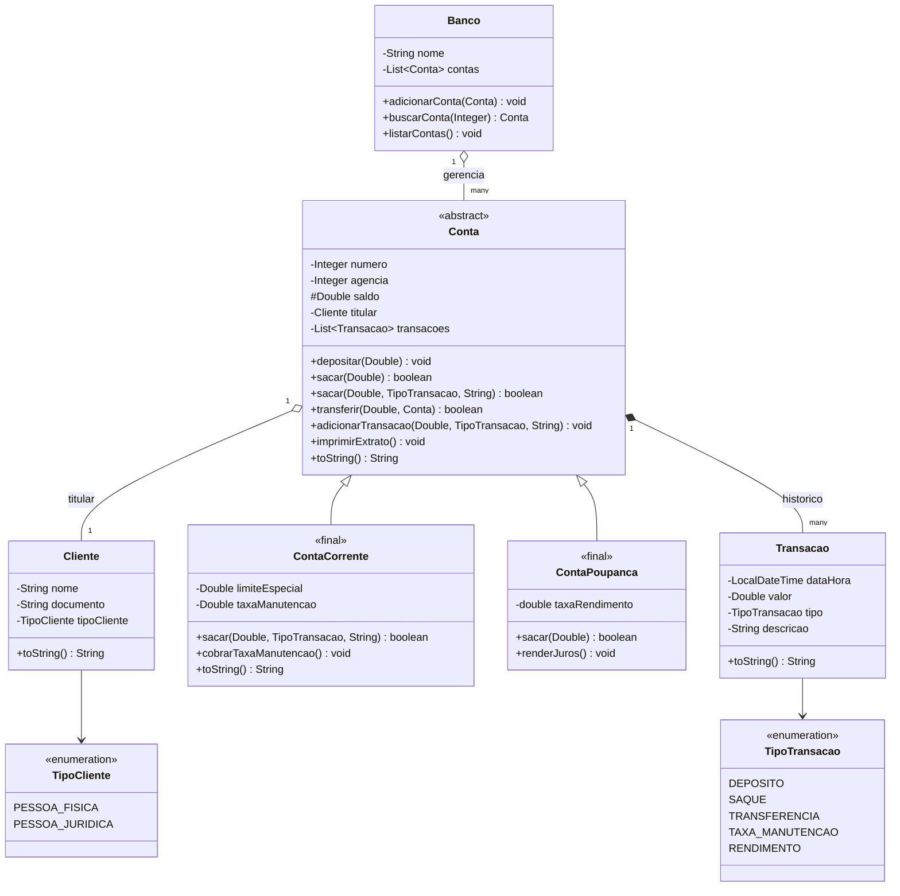

# Bank Simulator


| Camada | Tecnologia | Status no Projeto |
|---|---|---|
| Linguagem & Paradigma | Java 11+ / POO | 🟢 Concluído (em refinamento) |
| Gerenciador de Build | Apache Maven | 🟡 Próxima etapa |
| Framework Web | Spring Boot (REST) | ⚪ Planejado |
| Persistência de Dados | Spring Data JPA / Hibernate | ⚪ Planejado |
| Banco de Dados | H2 Database (em memória) | ⚪ Planejado |

---

Simulador de operações bancárias desenvolvido em **Java puro**, criado como projeto de estudo para consolidar os **fundamentos da Programação Orientada a Objetos (POO)**.

> **Nota de evolução:** Este repositório reflete o meu aprendizado prático e incremental. Enquanto esta primeira versão em Java puro estiver ativa, o código poderá passar por constantes ajustes e refatorações (melhorias de encapsulamento, visibilidade de atributos, tratamento de exceções e precisão decimal) à medida que consolido novas boas práticas, servindo como base sólida antes de avançar para a próxima versão oficial com Maven e Spring. Cada etapa terá sua própria branch/tag, permitindo comparar o "antes e depois" da arquitetura.

## Fundamentos de Java e POO praticados

| Conceito | Onde aparece no projeto |
|---|---|
| **Abstração** | `Conta` define o comportamento comum a qualquer tipo de conta (depositar, sacar, transferir, extrato), escondendo os detalhes específicos de cada subtipo. |
| **Herança** | `ContaCorrente` e `ContaPoupanca` estendem `Conta`, reaproveitando atributos e comportamentos da superclasse. |
| **Polimorfismo** | O método `sacar()` é sobrescrito (`@Override`) de forma diferente em `ContaCorrente` (considera limite especial) e `ContaPoupanca` (sem limite). O `Banco` manipula qualquer conta como `Conta`, sem saber o tipo concreto. |
| **Encapsulamento** | Atributos como `saldo`, `numero` e `titular` são privados/protegidos, expostos apenas via getters e métodos de comportamento (`depositar`, `sacar`), nunca alterados diretamente de fora da classe. |
| **Sobrecarga de métodos (overloading)** | `sacar(Double valor)` e `sacar(Double valor, TipoTransacao tipo, String descricao)` na classe `Conta`. |
| **Classes `final`** | `ContaCorrente` e `ContaPoupanca` são `final`, impedindo novas heranças a partir delas — uma decisão de design proposital. |
| **Enums** | `TipoCliente` e `TipoTransacao` substituem "strings mágicas" por tipos seguros e expressivos. |
| **Composição** | `Conta` possui um `Cliente` (titular) e uma lista de `Transacao`; `Banco` possui uma lista de `Conta`. Relações "tem-um" em vez de herança. |
| **Coleções (`List`/`ArrayList`)** | Usadas em `Banco` (lista de contas) e `Conta` (histórico de transações). |
| **Sobrescrita de `toString()`** | Cada entidade define sua própria representação textual, facilitando debug e exibição no console. |
| **Construtores default e customizados** | Todas as entidades possuem construtor vazio e construtor com parâmetros, facilitando a evolução futura do modelo para frameworks de persistência.|
| **Data e hora (`java.time`)** | `Transacao` usa `LocalDateTime` para registrar o momento de cada operação. |
| **Separação em pacotes** | `application` (ponto de entrada) e `entities` (modelo de domínio), antecipando a separação em camadas que o Spring exigirá futuramente (`controller`, `service`, `repository`, `entity`). |

## Estrutura do projeto

```text
bank-simulator/
└── src/
    ├── application/
    │   └── Main.java            # Ponto de entrada (simula operações no console)
    └── entities/
        ├── Banco.java           # Agrega e gerencia as contas
        ├── Cliente.java         # Titular da conta
        ├── Conta.java           # Classe base/abstrata do domínio
        ├── ContaCorrente.java   # Conta com limite especial e taxa de manutenção
        ├── ContaPoupanca.java   # Conta com rendimento por juros
        ├── Transacao.java       # Registro de cada movimentação
        ├── TipoCliente.java     # Enum: PESSOA_FISICA, PESSOA_JURIDICA
        └── TipoTransacao.java   # Enum: DEPOSITO, SAQUE, TRANSFERENCIA, TAXA_MANUTENCAO, RENDIMENTO
```

## Funcionalidades atuais

- Criar clientes (pessoa física/jurídica)
- Criar contas correntes (com limite especial e taxa de manutenção) e contas poupança (com rendimento)
- Depositar, sacar e transferir valores entre contas
- Cobrar taxa de manutenção (conta corrente) e render juros (conta poupança)
- Registrar e imprimir extrato de transações por conta
- Buscar conta pelo número através do `Banco`


## Exemplo de Execução (Console)

Ao executar a classe **Main.java**, a aplicação simula o ciclo de vida completo das operações bancárias:

```text
=== 1. CONTAS RECÉM-CRIADAS (SALDO INICIAL) ===
Tipo: ContaCorrente | Número da Conta: 1001 | Agência: 1 | Saldo: R$ 0.00 | Cliente: João Silva
Tipo: ContaPoupanca | Número da Conta: 2001 | Agência: 1 | Saldo: R$ 0.00 | Cliente: Maria Souza

=== 2. REALIZANDO MOVIMENTAÇÕES ===
Saque de R$ 1300,00 na Conta Corrente: true
Saque de R$ 5000,00 na Conta Poupança: false

=== 3. SALDOS FINAIS COM TIPO DE CONTA ===
Conta Corrente | Número: 1001 | Agência: 1 | Saldo: R$ -420.00 | Titular: João Silva | Limite Especial: R$ 500.00 | Taxa Manutenção: R$ 20.00
Conta Poupança | Número: 2001 | Agência: 1 | Saldo: R$ 2110.50 | Titular: Maria Souza | Taxa Rendimento: 0.005

=== 4. EXTRATO - CONTA CORRENTE (JOÃO) ===
Transacao: DEPOSITO | Valor: 1000.0 | Descricao: Depósito
Transacao: SAQUE | Valor: 1300.0 | Descricao: Saque
Transacao: TRANSFERENCIA | Valor: 100.0 | Descricao: Transferência para Maria Souza
Transacao: TAXA_MANUTENCAO | Valor: 20.0 | Descricao: Cobrança de taxa de manutenção

=== 5. EXTRATO - CONTA POUPANÇA (MARIA) ===
Transacao: DEPOSITO | Valor: 2000.0 | Descricao: Depósito
Transacao: DEPOSITO | Valor: 100.0 | Descricao: Depósito
Transacao: RENDIMENTO | Valor: 10.5 | Descricao: Aplicação de rendimento

=== 6. BUSCA DE CONTA PELO NÚMERO ===
Conta Corrente | Número: 1001 | Agência: 1 | Saldo: R$ -420.00 | Titular: João Silva | Limite Especial: R$ 500.00 | Taxa Manutenção: R$ 20.00
```

## Como executar

Pré-requisito: JDK instalado (11+).

```bash
# Compilar
javac -d bin src/application/Main.java src/entities/*.java

# Executar
java -cp bin application.Main
```

Ou, se preferir, basta abrir o projeto em uma IDE (VS Code, IntelliJ, Eclipse) e rodar a classe `Main.java` diretamente.

## Diagrama UML (classes)


## Roadmap (próximas etapas)

- [x] Modelagem do domínio em Java puro (POO)
- [ ] Migração para projeto **Maven** (gerenciamento de dependências e build)
- [ ] Introdução ao **Spring / Spring Boot** (camadas de Controller e Service)
- [ ] Persistência com **JPA / Hibernate**
- [ ] Banco de dados **H2** (em memória, para testes/desenvolvimento)
- [ ] Testes automatizados (JUnit)
- [ ] Exposição de uma API REST para as operações bancárias

## Licença

Distribuído sob os termos definidos no arquivo [LICENSE](./LICENSE).
