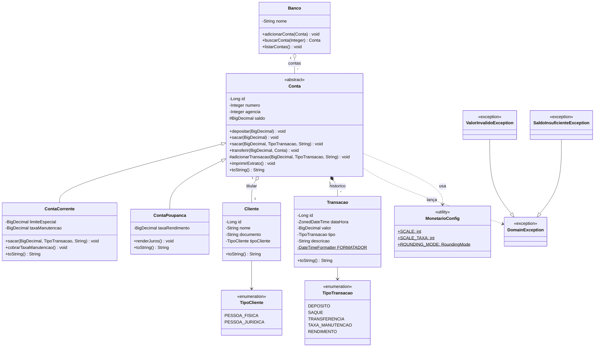

# Bank Simulator


| Camada                | Tecnologia                  | Status no Projeto            |
| --------------------- | ---------------------------- | ---------------------------- |
| Linguagem & Paradigma | Java 11+ / POO              | 🟢 Concluído (em refinamento) |
| Gerenciador de Build  | Apache Maven                | 🟡 Próxima etapa              |
| Framework Web         | Spring Boot (REST)          | ⚪ Planejado                  |
| Persistência de Dados | Spring Data JPA / Hibernate | ⚪ Planejado                  |
| Banco de Dados        | H2 Database (em memória)    | ⚪ Planejado                  |

---

Simulador de operações bancárias desenvolvido em **Java puro**, criado como projeto de estudo para consolidar os **fundamentos da Programação Orientada a Objetos (POO)**.

> **Nota de evolução:** Este repositório registra meu aprendizado prático e incremental. Esta primeira versão em Java puro passa por constantes refatorações à medida que consolido boas práticas de código, servindo como base para a próxima versão oficial com Maven e Spring.

## Fundamentos de Java e POO praticados

| Conceito                                | Onde aparece no projeto                                                                                                                                                                                                     |
| --------------------------------------- | --------------------------------------------------------------------------------------------------------------------------------------------------------------------------------------------------------------------------- |
| **Abstração**                           | `Conta` define o comportamento comum a qualquer tipo de conta (depositar, sacar, transferir, extrato), escondendo os detalhes específicos de cada subtipo.                                                                  |
| **Herança**                             | `ContaCorrente` e `ContaPoupanca` estendem `Conta`, reaproveitando atributos e comportamentos da superclasse.                                                                                                               |
| **Polimorfismo**                        | O método `sacar(BigDecimal, TipoTransacao, String)` é sobrescrito (`@Override`) em `ContaCorrente`, que passa a considerar o limite especial. `ContaPoupanca` não sobrescreve o método — usa a versão da superclasse, sem limite adicional. O `Banco` manipula qualquer conta como `Conta`, sem saber o tipo concreto. |
| **Encapsulamento**                      | Atributos como `saldo`, `numero` e `titular` são privados/protegidos, expostos apenas via getters e métodos de comportamento (`depositar`, `sacar`), nunca alterados diretamente de fora da classe.                         |
| **Sobrecarga de métodos (overloading)** | `sacar(BigDecimal valor)` e `sacar(BigDecimal valor, TipoTransacao tipo, String descricao)` na classe `Conta`.                                                                                                              |
| **Classes `final`**                     | `ContaCorrente` e `ContaPoupanca` são `final`, impedindo novas heranças a partir delas — uma decisão de design proposital.                                                                                                  |
| **Enums**                               | `TipoCliente` e `TipoTransacao` substituem "strings mágicas" por tipos seguros e expressivos.                                                                                                                               |
| **Composição**                          | `Conta` possui um `Cliente` (titular) e uma lista de `Transacao`; `Banco` possui uma lista de `Conta`. Relações "tem-um" em vez de herança.                                                                                 |
| **Coleções (`List`/`ArrayList`)**       | Usadas em `Banco` (lista de contas) e `Conta` (histórico de transações).                                                                                                                                                    |
| **Sobrescrita de `toString()`**         | Cada entidade define sua própria representação textual, facilitando debug e exibição no console.                                                                                                                            |
| **Construtores default e customizados** | Todas as entidades possuem construtor vazio e construtor com parâmetros, facilitando a evolução futura do modelo para frameworks de persistência.                                                                           |
| **Data e hora (`java.time`)**           | `Transacao` usa `ZonedDateTime` para registrar o momento de cada operação, já considerando fuso horário.                                                                                                                     |
| **Precisão decimal (`java.math`)**      | Valores monetários usam `BigDecimal` (nunca `double`/`Double`), com escala e modo de arredondamento centralizados em `MonetarioConfig` (`HALF_EVEN`, o chamado "arredondamento bancário").                                  |
| **Exceções de domínio**                 | `DomainException` (classe-base) e as especializações `ValorInvalidoException` e `SaldoInsuficienteException`, no pacote `model.exceptions`, protegem as regras de negócio das entidades.                                    |
| **Separação em pacotes**                | `application` (ponto de entrada), `model.entities` (modelo de domínio), `model.exceptions` (exceções de negócio) e `model.util` (configurações compartilhadas, como `MonetarioConfig`) — antecipando a separação em camadas que o Spring exigirá futuramente (`controller`, `service`, `repository`, `entity`). |

## Estrutura do projeto

```text
bank-simulator/
└── src/
    ├── application/
    │   ├── Main.java                    # Ponto de entrada (simula operações no console)
    │   └── Testes.java                  # Cenários de exceção e validação (console)
    └── model/
        ├── entities/
        │   ├── Banco.java               # Agrega e gerencia as contas
        │   ├── Cliente.java             # Titular da conta
        │   ├── Conta.java               # Classe base/abstrata do domínio
        │   ├── ContaCorrente.java       # Conta com limite especial e taxa de manutenção
        │   ├── ContaPoupanca.java       # Conta com rendimento por juros
        │   ├── Transacao.java           # Registro de cada movimentação
        │   ├── TipoCliente.java         # Enum: PESSOA_FISICA, PESSOA_JURIDICA
        │   └── TipoTransacao.java       # Enum: DEPOSITO, SAQUE, TRANSFERENCIA, TAXA_MANUTENCAO, RENDIMENTO
        ├── exceptions/
        │   ├── DomainException.java             # Exceção-base de regras de negócio
        │   ├── ValorInvalidoException.java      # Valores nulos, negativos ou zerados quando não permitido
        │   └── SaldoInsuficienteException.java  # Saldo (ou saldo + limite) insuficiente para saque/transferência
        └── util/
            └── MonetarioConfig.java      # Escala e modo de arredondamento (BigDecimal) usados em todo o domínio
```

## Funcionalidades atuais

- Criar clientes (pessoa física/jurídica)
- Criar contas correntes (com limite especial e taxa de manutenção) e contas poupança (com rendimento)
- Depositar, sacar e transferir valores entre contas, com valores em `BigDecimal`
- Cobrar taxa de manutenção (conta corrente) e render juros (conta poupança)
- Registrar e imprimir extrato de transações por conta
- Buscar conta pelo número através do `Banco`
- Validar regras de negócio via exceções de domínio (`DomainException` e subclasses), cobertas em `Testes.java`


## Exemplo de Execução (Console)

Ao executar a classe **Main.java**, a aplicação simula o ciclo de vida completo das operações bancárias:

```text
=== 1. CONTAS RECÉM-CRIADAS (SALDO INICIAL) ===
Tipo: ContaCorrente | Número da Conta: 1001 | Agência: 1 | Saldo: R$ 0.00 | Cliente: João Silva
Tipo: ContaPoupanca | Número da Conta: 2001 | Agência: 1 | Saldo: R$ 0.00 | Cliente: Maria Souza

=== 2. REALIZANDO MOVIMENTAÇÕES ===
Saque de R$ 1300,00 na Conta Corrente: true
Saque de R$ 200,00 na Conta Poupança: true

=== 3. SALDOS FINAIS COM TIPO DE CONTA ===
Conta Corrente | Número: 1001 | Agência: 1 | Saldo: R$ -420.00 | Titular: João Silva | Limite Especial: R$ 500.00 | Taxa Manutenção: R$ 20.00
Conta Poupança | Número: 2001 | Agência: 1 | Saldo: R$ 1909.50 | Titular: Maria Souza | Taxa Rendimento: 0.005

=== 4. EXTRATO - CONTA CORRENTE (JOÃO) ===
Transacao: DEPOSITO | Data hora: 08/09/2026 10:50:05 | Valor: 1000.0 | Descricao: Depósito
Transacao: SAQUE | Data hora: 08/09/2026 10:50:05 | Valor: 1300.0 | Descricao: Saque
Transacao: TRANSFERENCIA | Data hora: 08/09/2026 10:50:05 | Valor: 100.0 | Descricao: Transferência para Maria Souza
Transacao: TAXA_MANUTENCAO | Data hora: 08/09/2026 10:50:05 | Valor: 20.0 | Descricao: Cobrança de taxa de manutenção

=== 5. EXTRATO - CONTA POUPANÇA (MARIA) ===
Transacao: DEPOSITO | Data hora: 08/09/2026 10:50:05 | Valor: 2000.0 | Descricao: Depósito
Transacao: SAQUE | Data hora: 08/09/2026 10:50:05 | Valor: 200.0 | Descricao: Saque
Transacao: DEPOSITO | Data hora: 08/09/2026 10:50:05 | Valor: 100.0 | Descricao: Depósito
Transacao: RENDIMENTO | Data hora: 08/09/2026 10:50:05 | Valor: 9.5 | Descricao: Aplicação de rendimento

=== 6. BUSCA DE CONTA PELO NÚMERO ===
Conta Corrente | Número: 1001 | Agência: 1 | Saldo: R$ -420.00 | Titular: João Silva | Limite Especial: R$ 500.00 | Taxa Manutenção: R$ 20.00
Conta Poupança | Número: 2001 | Agência: 1 | Saldo: R$ 1909.50 | Titular: Maria Souza | Taxa Rendimento: 0.005
```

## Como executar

Pré-requisito: JDK instalado (11+).

```bash
# Compilar
javac -d bin src/application/*.java src/model/entities/*.java src/model/exceptions/*.java src/model/util/*.java

# Executar a simulação principal
java -cp bin application.Main

# Executar os cenários de exceção/validação
java -cp bin application.Testes
```

Ou, se preferir, basta abrir o projeto em uma IDE (VS Code, IntelliJ, Eclipse) e rodar a classe `Main.java` (ou `Testes.java`) diretamente.

## Diagrama UML (classes)



## Roadmap (próximas etapas)

- [x] Modelagem do domínio em Java puro (em refinamento)
- [ ] Migração para projeto **Maven** (gerenciamento de dependências e build)
- [ ] Introdução ao **Spring / Spring Boot** (camadas de Controller e Service)
- [ ] Persistência com **JPA / Hibernate**
- [ ] Banco de dados **H2** (em memória, para testes/desenvolvimento)
- [ ] Testes automatizados (JUnit)
- [ ] Exposição de uma API REST para as operações bancárias

## Licença

Distribuído sob os termos definidos no arquivo [LICENSE](./LICENSE).